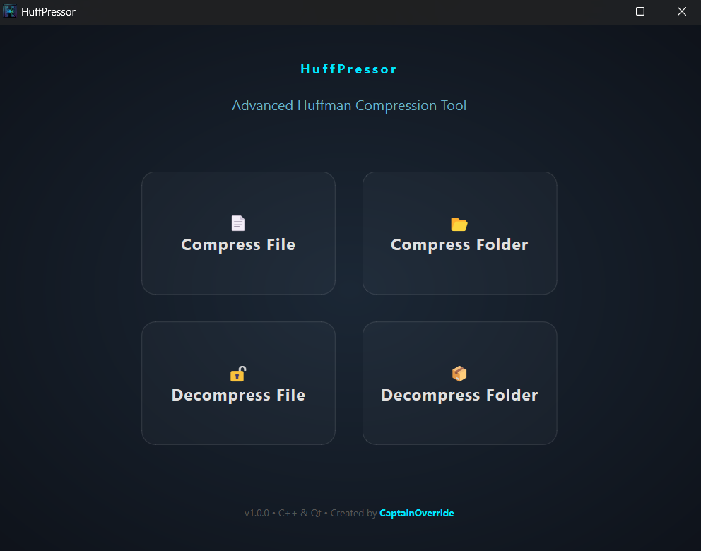
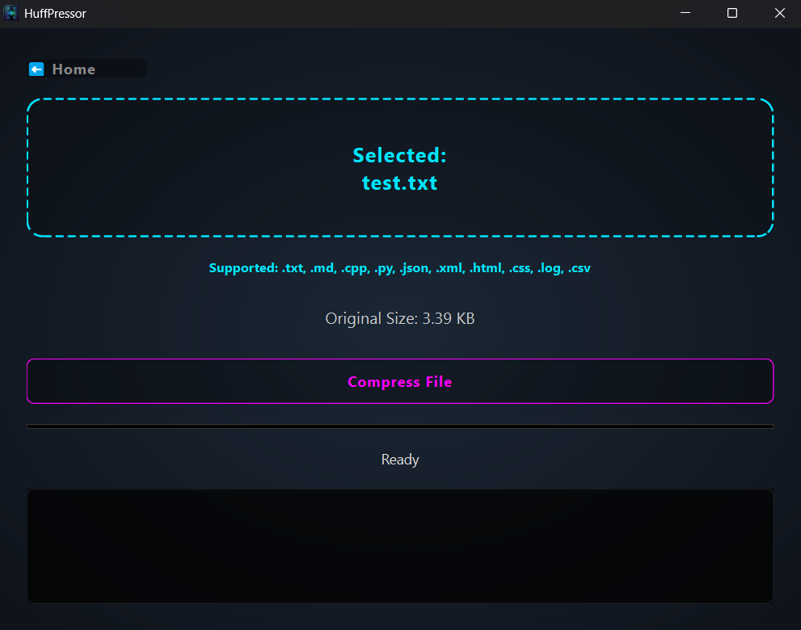
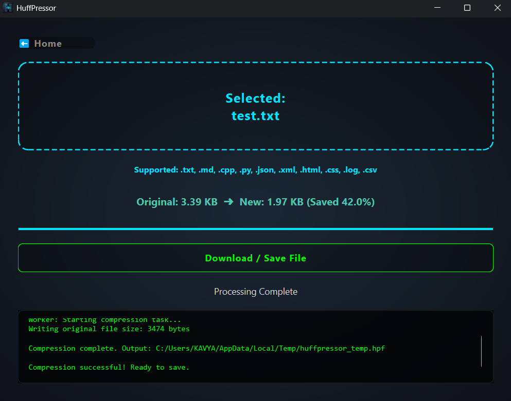
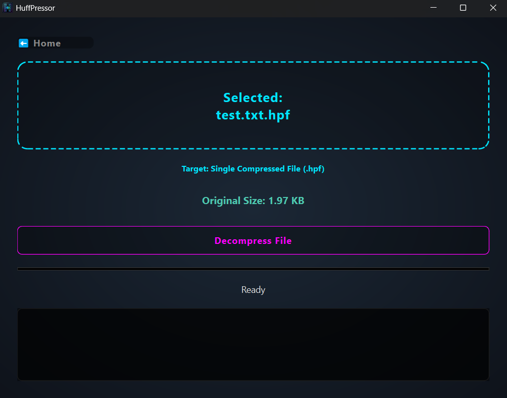
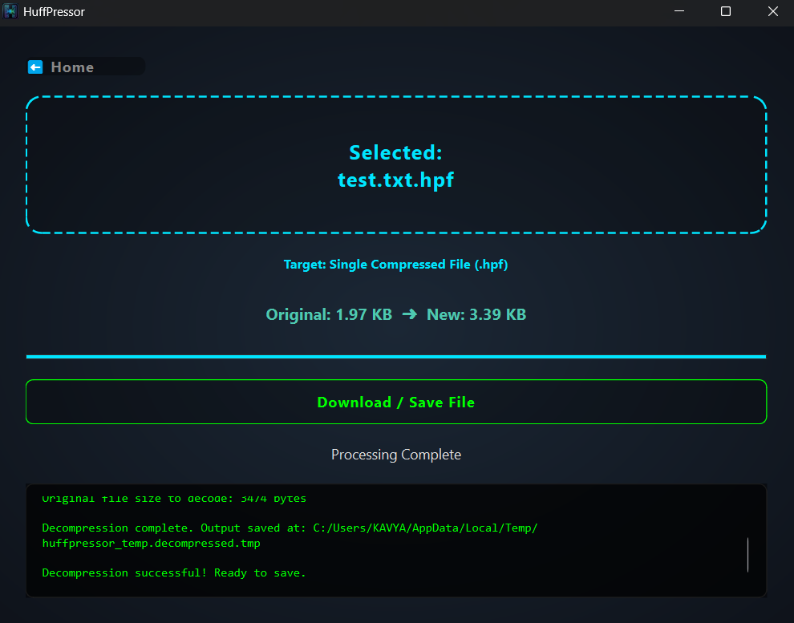

# 🗜️ HuffPressor

**Advanced Huffman Compression Tool** with a modern cyberpunk-themed UI.


---

## ✨ Features

- 🗜️ **File Compression** - Compress text files using the Huffman coding algorithm
- 📦 **Folder Archiving** - Archive entire folders into `.hpa` files
- 🔓 **Decompression** - Extract `.hpf` files and `.hpa` archives
- ✅ **Smart Validation** - Automatic file type checking for each operation
- 🎨 **Modern UI** - Cyberpunk-themed interface with neon blue accents
- 🖱️ **Drag & Drop** - Easy file selection via drag and drop
- 📊 **Real-time Progress** - Visual feedback during compression/decompression
- 💾 **Custom Format** - Efficient binary format for compressed data

---

## 📸 Screenshots

### Home Page


### Compress File


### Compress File - Result


### Decompress File


### Decompress File - Result


---

## 🚀 Quick Start

### Download (Windows)

1. Go to [Releases](https://github.com/CaptainOverride/HuffPressor/releases)
2. Download `HuffPressor-v1.0.0-Windows.zip`
3. Extract and run `HuffPressor.exe`

### Usage

1. **Launch** the application
2. **Choose** an operation:
   - 📄 **Compress File** - Select a text file to compress
   - 📂 **Compress Folder** - Select a folder to archive
   - 🔓 **Decompress File** - Extract a `.hpf` file
   - 📦 **Decompress Folder** - Extract a `.hpa` archive
3. **Select** your file or folder (or drag & drop)
4. **Save** the result!

---

## 📦 Supported File Types

### Compression
**Text Files** (where Huffman coding is most effective):
- `.txt`, `.md`, `.cpp`, `.h`, `.c`, `.hpp`
- `.py`, `.java`, `.js`, `.ts`
- `.html`, `.css`, `.json`, `.xml`
- `.log`, `.csv`, `.yaml`, `.yml`
- And more...

**Folders**: All folder types (text-heavy folders recommended)

### Decompression
- `.hpf` - HuffPressor File (compressed file)
- `.hpa` - HuffPressor Archive (compressed folder)

> **Note:** Binary files (images, videos, executables) are already compressed and won't benefit from Huffman coding.

---

## 🛠️ Build from Source

### Prerequisites

- **CMake** 3.15 or higher
- **Qt 6.10.1** (Qt6 Widgets, Qt6 Core, Qt6 Gui)
- **C++20** compatible compiler
  - MinGW-W64 GCC 14.1.0 (Windows)
  - Or MSVC 2019+ (Windows)
  - Or GCC 10+ / Clang 10+ (Linux/macOS)
- **Git**

### Build Instructions

```bash
# Clone the repository
git clone https://github.com/CaptainOverride/HuffPressor.git
cd HuffPressor

# Create build directory
mkdir build
cd build

# Configure with CMake
cmake ..

# Build
cmake --build . --config Release

# Run
./HuffPressor.exe  # Windows
```

---

## 🧮 How It Works

HuffPressor uses the **Huffman Coding** algorithm, a lossless data compression technique that:

1. **Analyzes** character frequency in the input
2. **Builds** a binary tree with frequent characters having shorter codes
3. **Encodes** the data using variable-length codes
4. **Stores** the tree structure and encoded data in a custom binary format

This results in significant compression for text-based files where character frequencies vary.

### File Format

**`.hpf` (HuffPressor File):**
- Header with metadata
- Huffman tree structure
- Compressed bit stream
- Original file size

**`.hpa` (HuffPressor Archive):**
- Archive header
- Compressed folder structure
- Multiple compressed files
- Metadata for reconstruction

---

## 🎨 UI Design

The application features a **cyberpunk-themed** interface with:
- Dark radial gradient background
- Neon blue (#00e5ff) accents and glow effects
- Glass-morphic panels
- Smooth hover animations
- Responsive 2x2 grid layout

---

## 📝 Technical Details

- **Language:** C++20
- **Framework:** Qt 6.10.1
- **Algorithm:** Huffman Coding
- **Platform:** Windows x64
- **Build System:** CMake 3.15+
- **Compiler:** MinGW-W64 GCC 14.1.0
- **Architecture:** Multi-threaded (Qt Worker threads)

### Project Structure

```
HuffPressor/
├── .gitignore              # Git ignore rules
├── .gitattributes          # Git attributes
├── CMakeLists.txt          # Build configuration
├── LICENSE                 # MIT License
├── README.md               # This file
│
├── include/                # Public header files
│   ├── archiver.h
│   ├── bitReader.h
│   ├── bitWriter.h
│   ├── compressor.h
│   ├── decompressor.h
│   ├── errors.h
│   ├── huffmanTree.h
│   └── utils.h
│
├── src/                    # Source code
│   ├── cli/                # Command-line interface
│   │   └── main.cpp
│   ├── core/               # Core compression logic
│   │   ├── archiver.cpp
│   │   ├── bitReader.cpp
│   │   ├── bitWriter.cpp
│   │   ├── compressor.cpp
│   │   ├── decompressor.cpp
│   │   ├── huffmanTree.cpp
│   │   └── utils.cpp
│   └── gui/                # Qt GUI application
│       ├── main.cpp
│       ├── mainWindow.cpp
│       ├── mainWindow.h
│       ├── worker.cpp
│       └── worker.h
│
├── resources/              # Application resources
│   ├── icon.ico           # Windows icon
│   ├── icon.png           # Application icon
│   ├── resources.qrc      # Qt resource file
│   └── windows_icon.rc    # Windows resource file
│
└── screenshots/            # Screenshots for README
    ├── home.png
    ├── compress-file.png
    ├── compress-file-result.png
    ├── decompress-file.png
    └── decompress-file-result.png
```

**Note:** The `build/` directory is generated during compilation and is not tracked by Git.

---

## 🤝 Contributing

Contributions, issues, and feature requests are welcome! This is a personal project, but I'm open to improvements.

**How to contribute:**

1. **Fork** the repository
2. **Create** a feature branch (`git checkout -b feature/AmazingFeature`)
3. **Commit** your changes (`git commit -m 'Add some AmazingFeature'`)
4. **Push** to the branch (`git push origin feature/AmazingFeature`)
5. **Open** a Pull Request

**Before contributing:**
- Check existing issues to avoid duplicates
- For major changes, open an issue first to discuss
- Keep pull requests focused on a single feature/fix

**Note:** This is a personal project maintained in my free time. Response times may vary, but all contributions are appreciated!

### 💡 Ideas for Contribution
- Bug fixes and improvements
- Better error handling
- Performance optimizations
- Documentation improvements
- Cross-platform support (Linux, macOS)
- Unit tests
- Command-line interface

---

## 📄 License

This project is licensed under the MIT License - see the [LICENSE](LICENSE) file for details.

---

## 🐛 Known Issues

- None reported yet! Please [open an issue](https://github.com/CaptainOverride/HuffPressor/issues) if you find any bugs.

---

## 🗺️ Roadmap

- [ ] Command-line interface
- [ ] Compression statistics dashboard
- [ ] Batch file processing
- [ ] Cross-platform support (Linux, macOS)
- [ ] Compression ratio comparison
- [ ] Custom compression profiles

---

## 👨‍💻 Author

**CaptainOverride**
- GitHub: [@CaptainOverride](https://github.com/CaptainOverride)

---

## 🙏 Acknowledgments

- Engineered with [Qt Framework](https://www.qt.io/)
- Huffman Coding algorithm by David A. Huffman (1952)
- UI inspired by modern cyberpunk aesthetics

---

## ⭐ Star History

If you find this project useful, please consider giving it a star! ⭐

---

<div align="center">

**Engineered with ❤️ by CaptainOverride**

[Report Bug](https://github.com/CaptainOverride/HuffPressor/issues) · [Request Feature](https://github.com/CaptainOverride/HuffPressor/issues)

</div>
